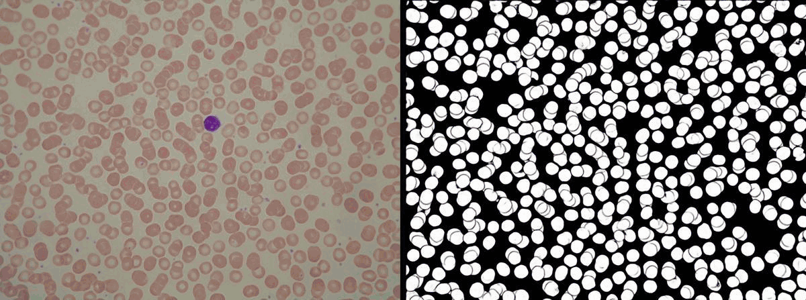

# CellAlyse

## Zusammenfassung
In diesem Repository befindet sich der Code vom Netzwerk, welches für das Zählen von Blutkörperchen benutzt wird.
Das Model segmentiert Plättchen, rote Blutkörperchen oder weiße Blutkörperchen, aber nicht alles zusammen.
Nach der Segmentierung können verschieden Algorithmen zur Zählung angewendet werden. Der primäre
Zählalgorithmus ist der Hough Transform Algorithmus, welcher die Zählung von kreisförmigen Objekten ermöglicht.
Dieser ist auch für Blutkörperchen umgeschrieben worden.

## Hintergrund
Das Zählen von Blutkörperchen ist ein wichtiger Bestandteil der Diagnose von Krankheiten. Bei der manuellen Zählung
wird ein Blutausstrich unter ein Mikroskop gelegt und die Anzahl der Blutkörperchen gezählt. Dies ist jedoch sehr zeitaufwendig
und kann zu Fehlern führen. Daher werden machine learning Methoden benutzt, um die Zählung zu automatisieren.

Vorherige Methoden konnten keine ausreichende Genauigkeit erreichen, da sie keine überlappenden Zellen erkennen konnten.
Unser Netzwerk kann überlappende Zellen segmentieren. Dies ist durch das Subtrahieren der Rändermaske und der Segmentierungsmaske möglich.
Bei der Zählung auf unseren Datensatz konnte eine Genauigkeit von ~98% erreicht werden.


## Galerie
### Zählmethoden

| |
| :---: |
| *Distance Transform* |

|  |
| :---: |
| *Component Labeling* |

|  |
| :---: |
| *Circle Hough Transform* |

### Segmentierung
|  |
| :---: |
| *Segmentierung auf Testbildern* |

## Installation

Für Windows user
```bash
git clone https://github.com/CellAlyse/CellAlyse
cd CellAlyse
pip install -r requirements.txt
python download.py
python src/main.py
```
wenn man Linux oder MacOS benutzt:
```bash
bash setup.sh
```
